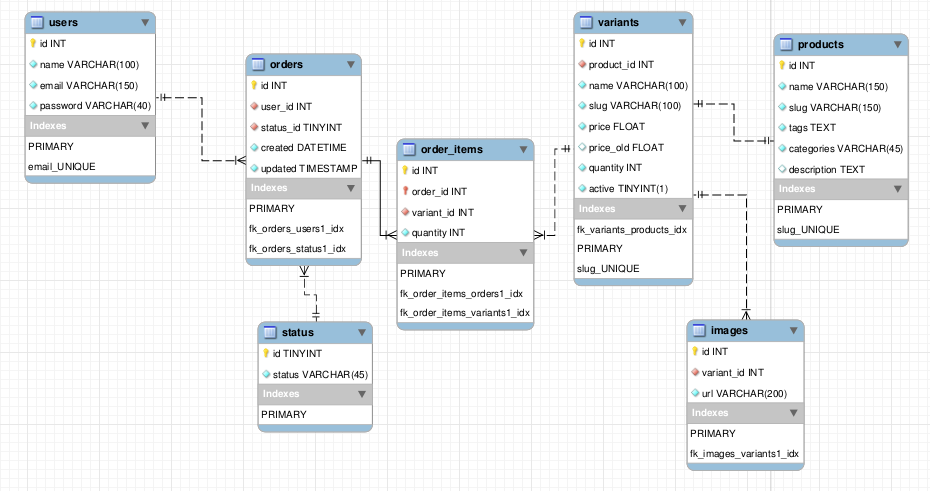
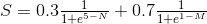

Desafio back-end AMARO
==========================
## Sobre o desafio
O desafio consiste em fazer dois exercícios de lógica e a criação de uma API.
Você pode criar a aplicação como bem entender e a única regra é: usar a linguagem PHP7 (preferencialmente com um framework moderno) com banco de dados MySQL.

## Desafio 1 - Caixa eletrônico
    Desenvolva um programa que simule a entrega de notas quando um cliente efetuar um saque em um caixa eletrônico. Os requisitos básicos são os seguintes:
    - Entregar o menor número de notas;
    - É possível sacar o valor solicitado com as notas disponíveis;
    - Saldo do cliente infinito;
    - Quantidade de notas finito;
    - Notas disponíveis de R$ 100,00; R$ 50,00; R$ 20,00, R$ 10,00, R$ 5,00, R$ 2,00, R$ 1,00
    
    Exemplos:

    Valor do Saque: R$ 30,00 – Resultado Esperado: Entregar 1 nota de R$20,00 e 1 nota de R$ 10,00.
    Valor do Saque: R$ 80,00 – Resultado Esperado: Entregar 1 nota de R$50,00 1 nota de R$ 20,00 e 1 nota de R$ 10,00.

## Desafio 2 - Explosão de string
    Desenvolva uma classe que receba a string e divida essa string a partir de um delimitador, é proibido utilizar a função 'explode()'.
    Exemplo:
        A entrada 'aaa,bbb,ccc,ddd' terá como saída ['aaa', 'bbb', 'ccc', 'ddd']

## Desafio 3 - Construção de API
A seguir temos o link para o banco de dados e o diagrama ER.

[Banco de dados](db.sql)

### Regras gerais da API
- A API deve permitir cadastrar, editar e listar todos os produtos ou um produto específico (products/variants)
- A API deve permitir recuperar todas os pedidos de um usuário (orders), onde:
    - A partir de cada pedido, deve ser possível listar os produtos, preços e imagens de cada produto
    - Deve ser possível filtrar todos os pedidos que foram finalizados com sucesso e também aqueles que estão aguardando pagamento
- Criar um pedido para um usuário
- A API de produtos deve retornar uma array com os três produtos mais similares, de acordo com a definição de similaridade abaixo (dica: crie um job batch que calcula as similaridades entre dois produtos, salvando-os em uma tabela separada).

### Definição de Similaridade
- As categorias e tags estão na tabela products
- Note que o valor de S é sempre entre 0.2 e 1, sendo que quanto mais próximo de 1 maior a similaridade.
- A similaridade entre dois produtos é definida por:

    - N = número de tags em comum entre os dois produtos (N >= 0)
    - M = número de categorias em comum entre os dois produtos (M >= 0)
    - e = número de euler

### Endpoints API
 - GET /products : lista todos os produtos
 - POST /products : cria um novo produto
 - PUT /products/{ID do produto} : atualiza as informações do produto com esta ID
 - GET /products/{ID do produto} : lista as informações do produto com esta ID,  - inclusive os três produtos mais similares
 - GET /orders : lista todos os pedidos
 - GET /orders/{ID do pedido} : lista as informações do pedido com esta ID
 - GET /orders?status={status_code} : lista todos os pedidos com um determinado  - código de status
 - GET /orders/{ID do pedido}/products : lista os itens do pedido com esta ID
 - POST /orders : cria um novo pedido ; deve ser informado o ID do usuário

### Documentação da API
Crie uma documentação com as rotas, respostas das rotas e instruções de uso da aplicação.

## Critérios de Avaliação
O projeto será avaliado pela equipe de desenvolvimento da AMARO, que irá basear-se nos seguintes critérios:

- **Organização** : Estrutura de pastas e arquivos, separation of concerns;
- **Manutenibilidade** : Legibilidade, comentários, simplicidade, modularidade;
- **Implementação** : Implementação da lógica, uso de orientação a objetos e design patterns;
- **Desempenho** : Tempo de execução e/ou de resposta;
- **Qualidade** : Elaboração e execução de testes (TDD);
- **Documentação** : Instruções de instalação e execução; descrições de funcionamento interno;
